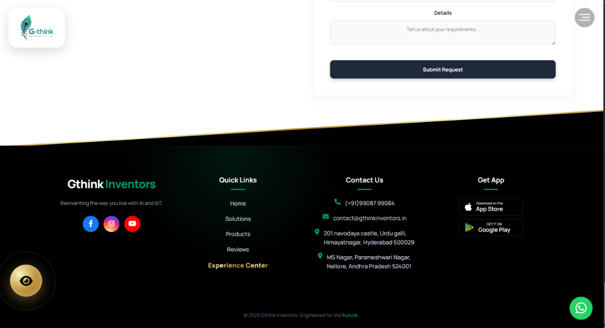

# Gthink Inventors | AI-Powered Smart Home Automation

Welcome to the official repository of **Gthink Inventors**, a premium smart home automation solution designed for modern living. We specialize in AI-powered retrofit modules and luxury touch panels that seamlessly integrate into your home, office, hotel, or hospital environment.

## 🚀 Live Demo
Experience the future of intelligent living here:  
**[https://amkreddy555.github.io/GExperinceV4/](https://amkreddy555.github.io/GExperinceV4/)**

---

## 📸 Project Previews

### Desktop Experience

### Mobile-Ready Design

### Professional Support & Contact

---

## ✨ Key Features

-   **Retrofit G-Switch Modules**: Transform any standard switchboard into a smart one without structural changes.
-   **Luxury Touch Panels**: Premium capacitive glass interfaces for high-end aesthetics.
-   **Eco-Luxe Theme**: A design philosophy that balances eco-friendly materials with digital luxury.
-   **Multi-Sector Solutions**:
    -   **Home**: Smart lighting, security, and climate control.
    -   **Hotel**: Guest room management and digital check-ins.
    -   **Office**: Room booking and biometric access.
    -   **Hospital**: Nurse call systems and asset tracking.
-   **Interactive Experience Center**: A virtual showroom to test lighting and automation scenarios.
-   **Cross-Platform Control**: Seamlessly manage your home via our mobile apps (iOS & Android).

## 🛠️ Technology Stack

-   **Frontend**: Semantic HTML5, CSS3 (Modern Flexbox/Grid), Vanilla JavaScript (ES6+).
-   **Animations**: Custom CSS animations and intersection observer for scroll-based reveals.
-   **Integration**: YouTube Data API for video catalogues, Font Awesome for iconography.
-   **Connectivity**: WhatsApp integration for direct support and consultation.

## 📱 Mobile App Links
-   **iOS**: [Download on the App Store](https://apps.apple.com/us/app/g-smart-home/id1461259217)
-   **Android**: [Get it on Google Play](https://play.google.com/store/apps/details?id=gthinkinventors.in)

---

## 📞 Get In Touch
-   **Website**: [www.gthinkinventors.in](http://www.gthinkinventors.in)
-   **Email**: contact@gthinkinventors.in
-   **WhatsApp**: [+91 99087 99084](https://wa.me/919908799084)

© 2025 Gthink Inventors. Engineered for the Future.
